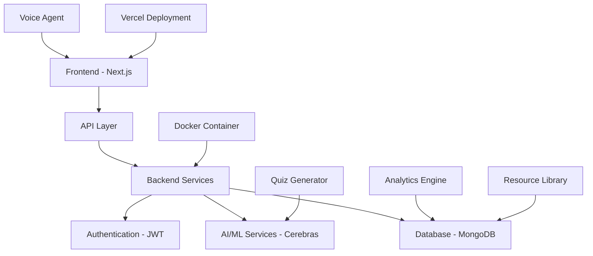

<div align="center" style="display: flex; flex-wrap: wrap; justify-content: center; gap: 12px;">
    <a href="https://future-stack-gen-ai-hackathon.vercel.app/app">
        
    </a>
    <a href="LICENSE">
        
    </a>
</div>

StudySnap is a revolutionary AI-powered learning platform designed to support both students and educational institutions in their digital transformation journey. Built with accessibility and affordability in mind, StudySnap provides an intelligent, scalable alternative to expensive educational platforms.

---

## 🌟 Key Features

| Feature                               | Description                                                                                                                                |
| ------------------------------------- | ------------------------------------------------------------------------------------------------------------------------------------------ |
| 🤖 **Textbook-Grounded AI Chatbot**   | Answers questions directly from official textbooks; no external solution books needed; context-aware responses based on curriculum content |
| 📝 **Intelligent Quiz Generator**     | AI-powered quiz creation from study material; supports easy, medium, hard levels; personalized for exam prep                               |
| 🎙️ **Voice Learning Agent**           | Natural conversation with textbooks; voice-based learning for accessibility; interactive study sessions                                    |
| 📊 **Multi-Board Support**            | Covers CBSE, ICSE, TN Matric boards; custom textbook upload; curriculum-aligned content                                                    |
| 📈 **Advanced Analytics Dashboard**   | Tracks syllabus coverage, study streaks, class rank, weekly study hours, and progress trends                                               |
| 📚 **Comprehensive Resource Library** | Previous year papers, important questions, curated resources, board-specific materials                                                     |

---

## 🎯 Problems We Solve

<div align="center">

| Problem                                 | StudySnap Solution                                          |
| --------------------------------------- | ----------------------------------------------------------- |
| **Resource-Heavy Traditional Learning** | AI-powered interactive learning with instant feedback       |
| **Time-Consuming Textbook Navigation**  | Smart chatbot that answers directly from textbooks          |
| **Expensive Digital Platforms**         | Affordable, scalable solution for all institutions          |
| **Lack of Personalized Tracking**       | Comprehensive analytics and progress insights               |
| **Limited Infrastructure Access**       | Lightweight, cloud-based platform with offline capabilities |

</div>

---

## 🏗️ Project Architecture



### Tech Stack

|                                                             **Programming Languages**                                                              |                                                                                           **Web Development**                                                                                            |                                                             **Databases & Tools**                                                              |                               **AI/ML & Data Science**                               |
| :------------------------------------------------------------------------------------------------------------------------------------------------: | :------------------------------------------------------------------------------------------------------------------------------------------------------------------------------------------------------: | :--------------------------------------------------------------------------------------------------------------------------------------------: | :----------------------------------------------------------------------------------: |
|    |     |    |        |

|                                   **DevOps & Infrastructure**                                   |                                  **Design & Development Tools**                                  |                                       **Operating Systems**                                       |
| :---------------------------------------------------------------------------------------------: | :----------------------------------------------------------------------------------------------: | :-----------------------------------------------------------------------------------------------: |
|    |   |   |

---

## 📁 Folder Structure

```
studysnap/
├── 📁 backend/                # Backend services
│   ├── 📁 book/               # Add Books here
│   ├── agent.py               # AI agent implementation
│   ├── app.py                 # Main Flask/FastAPI application
│   ├── config.py              # Configuration settings
│   ├── document_pinecone.py   # Document indexing with Pinecone
│   ├── query_pinecone.py      # Query processing
│   ├── requirements_rag.txt   # Python dependencies
│   └── DockerFile             # Backend containerization
│
├── 📁 src/                    # Frontend source code
│   ├── 📁 app/                # Next.js app directory
│   │   ├── layout.tsx         # Root layout
│   │   ├── page.tsx           # Home page
│   │   ├── globals.css        # Global styles
│   │   ├── 📁 (app)/          # App routes
│   │   ├── 📁 (landingpage)/  # Landing page routes
│   │   └── 📁 api/            # API routes
│   │
│   ├── 📁 components/         # Reusable UI components
│   │   ├── 📁 app/            # App-specific components
│   │   ├── 📁 landingPage/    # Landing page components
│   │   ├── 📁 ui/             # Base UI components
│   │   └── 📁 quizz/          # Quiz components
│   │
│   ├── 📁 hooks/              # Custom React hooks
│   ├── 📁 lib/                # Utility libraries
│   └── 📁 stores/             # State management (Zustand)
│
├── 📁 public/                 # Static assets
│   ├── 📁 boards/             # Board-specific images
│   ├── 📁 sponsors/           # Sponsor logos
│   └── ...                    # Other static files
│
├── 📄 package.json            # Dependencies and scripts
├── 📄 next.config.ts          # Next.js configuration
├── 📄 tailwind.config.js      # Tailwind CSS configuration
├── 📄 tsconfig.json           # TypeScript configuration
└── 📄 components.json         # shadcn/ui configuration
```

---

## 🚀 Getting Started

### Prerequisites

Before you begin, ensure you have the following installed:

- **Node.js** (v18.0.0 or higher)
- **npm** or **yarn** or **pnpm**
- **Python** (v3.8 or higher) for backend services
- **Git**

### Installation

1. **Clone the repository**

   ```bash
   git clone https://github.com/girish-gaikwad/FutureStack_genAI_Hackathon.git
   cd FutureStack_genAI_Hackathon
   ```

2. **Install frontend dependencies**

   ```bash
   npm install
   # or
   yarn install
   # or
   pnpm install
   ```

3. **Install backend dependencies**

   ```bash
   cd backend
   python -m venv venv
   /venv/Scripts/Activate
   pip install -r requirements_rag.txt
   cd ..
   ```

4. **Environment Configuration**

   Create a `.env.local` file in the root directory:

   ```env
   LIVEKIT_API_KEY=YOUR_LIVEKIT_API_KEY_HERE
   LIVEKIT_API_SECRET=YOUR_LIVEKIT_API_SECRET_HERE
   LIVEKIT_URL=YOUR_LIVEKIT_URL_HERE
   NEXT_PUBLIC_API_URL=http://localhost:3000/api
   ```
    Create a `.env.local` file in the ./Backend directory:

   ```env
   MONGODB_URI=your_mongodb_connection_string
   PINECONE_API_KEY=your-pinecone-api-key-here
   PINECONE_INDEX_NAME=document-collection
   PINECONE_DIMENSION=384
   EMBEDDING_MODEL=sentence-transformers/all-MiniLM-L6-v2
   LIVEKIT_API_KEY=your-livekit-api-key
   LIVEKIT_API_SECRET=your-livekit-secret
   LIVEKIT_URL=wss://your-livekit-url
   DEEPGRAM_API_KEY=your-deepgram-api-key
   HF_TOKEN=your-huggingface-token
   HF_CACHE_DIR=./hf_cache
   CEREBRAS_API_KEY=your-cerebras-api-key
   SECRET_KEY=change-me-in-production
   JWT_SECRET_KEY=change-me-in-production
   DATABASE_URL=sqlite:///app.db
   FLASK_ENV=development
   PORT=7860
   ```

5. **Start the development servers**

   **Frontend:**

   ```bash
   npm run dev
   ```

   **Backend (in a separate terminal):**

   ```bash
   cd backend
   python app.py
   ```

6. **Open your browser**
   Navigate to [http://localhost:3000](http://localhost:3000)

---

## 🐳 Docker Deployment

### Build and run with Docker

```bash
# Build the backend image
cd backend
docker build -t studysnap-backend .

# Run the backend container
docker run -p 8000:8000 --env-file .env studysnap-backend

# Build and run frontend (from root directory)
docker build -t studysnap-frontend .
docker run -p 3000:3000 studysnap-frontend
```

### Using Docker Compose

```bash
docker-compose up --build
```

---

## 📊 Usage Examples

### 1. **Chatbot Interaction**

Below is an example of how to call the FastAPI RAG backend's `/query` endpoint. The server expects a JSON body with the following shape:

- `query` (string) - the user's question or prompt
- `book` (string, optional) - an optional book filter
- `message` (array of role/content objects, optional) - an optional chat history to include
- `n_results` (number, optional) - how many matching document chunks to fetch

Example request (browser / Node):

```javascript
// POST /query example
const payload = {
   query: "Explain photosynthesis from Chapter 6",
   book: "Biology Textbook - Class 10",
   message: [
      { role: "system", content: "You are a helpful assistant for educational books." },
      { role: "user", content: "Summarize the key points on photosynthesis." }
   ],
   n_results: 3
};

const res = await fetch("/api/query", {
   method: "POST",
   headers: { "Content-Type": "application/json" },
   body: JSON.stringify(payload)
});

const data = await res.json();
console.log(data);
```

Typical successful response shape:

```json
{
   "message": "<assistant generated answer string>",
   "sources": [
      { "id": "vec-id-1", "book": "Biology Textbook - Class 10", "page": 42, "score": 0.93 },
      ...
   ],
   "available_books": ["Biology Textbook - Class 10", "Chemistry Textbook - Class 10"],
   "query_book_filter": "Biology Textbook - Class 10"
}
```

If you want to generate quizzes from the indexed books, use the `/quizz` endpoint with the following body:

```javascript
// POST /quizz example
const quizPayload = { book: "Biology Textbook - Class 10", n_results: 5, question: 10 };
const quizRes = await fetch('/api/quizz', {
   method: 'POST',
   headers: { 'Content-Type': 'application/json' },
   body: JSON.stringify(quizPayload)
});
const quizData = await quizRes.json();
console.log(quizData);
```

The `/quizz` response contains a JSON-schema validated quiz in `message`, the `available_books` list and the `query_book_filter` used.


### 2. **Quiz Generation**

```javascript
// Generate quiz from study material
const quiz = await fetch("/api/quiz/generate", {
  method: "POST",
  body: JSON.stringify({
    topic: "Chemical Reactions",
    difficulty: "medium",
    questionCount: 10,
  }),
});
```

---

## 🤝 Contributing

We welcome contributions from the community! Here's how you can help:

### Development Workflow

1. **Fork the repository**
2. **Create a feature branch**
   ```bash
   git checkout -b feature/amazing-feature
   ```
3. **Make your changes**
4. **Write or update tests**
5. **Commit your changes**
   ```bash
   git commit -m "Add amazing feature"
   ```
6. **Push to your branch**
   ```bash
   git push origin feature/amazing-feature
   ```
7. **Open a Pull Request**

### Code Style Guidelines

- Follow TypeScript/ESLint configurations
- Use Prettier for code formatting
- Write meaningful commit messages
- Add JSDoc comments for functions
- Ensure responsive design principles

### Issues and Bug Reports

- Use GitHub Issues for bug reports
- Provide detailed reproduction steps
- Include browser/environment information
- Add screenshots when applicable

---

## 🌟 Roadmap
| Phase                | Timeline         | Features                                                                                                                                           | Status      |
|----------------------|------------------|----------------------------------------------------------------------------------------------------------------------------------------------------|-------------|
| **Phase 1 (Current)**| Q1 2025          | - AI-powered chatbot with textbook grounding<br>- Quiz generation system<br>- Multi-board support (CBSE, ICSE, TN Matric)<br>- Analytics dashboard<br>- Voice learning agent | ✅ Completed |
| **Phase 2**          | Q2 2025          | - Mobile app with React Native<br>- Offline mode for low-infrastructure areas<br>- Advanced gamification features<br>- Teacher dashboard and classroom management | ⏳ Upcoming  |
| **Phase 3**          | Q3–Q4 2025       | - Multi-language support<br>- Regional board expansion<br>- AI-powered study plan generation<br>- Integration with LMS platforms<br>- Advanced analytics and insights | ⏳ Upcoming  |
| **Phase 4**          | 2026             | - AR/VR learning experiences<br>- Peer-to-peer learning features<br>- Marketplace for educational content<br>- White-label solutions for institutions | ⏳ Upcoming  |

---
## 📞 Support & Community

### Get Help

- 💼 [LinkedIn](https://www.linkedin.com/in/girish-gaikwad2055)
- 💬 [Discord Community](https://discord.gg/studysnap)
- 📧 [Email Support](mailto:girishgaikwad2055@gmail.com)
- 🐛 [Report Issues](https://github.com/girish-gaikwad/FutureStack_genAI_Hackathon/issues)

---

## 📜 License

This project is licensed under the MIT License - see the [LICENSE](LICENSE) file for details.

```
MIT License

Copyright (c) 2025 StudySnap Team

Permission is hereby granted, free of charge, to any person obtaining a copy
of this software and associated documentation files (the "Software"), to deal
in the Software without restriction, including without limitation the rights
to use, copy, modify, merge, publish, distribute, sublicense, and/or sell
copies of the Software, and to permit persons to whom the Software is
furnished to do so, subject to the following conditions:

The above copyright notice and this permission notice shall be included in all
copies or substantial portions of the Software.
```

---

## 🙏 Acknowledgments

### Special Thanks

- **FutureStack AI Hackathon** organizering the this Event
- **Cerebras** for AI model optimization support
- **Docker** for containerization and easy deployment
- **Meta** for open-source contributions and developer resources
- **Open Source Community** for incredible tools and libraries

### Built With Love By

- **[Girish Gaikwad](https://github.com/girish-gaikwad)** - Full Stack Developer & AI Engineer
- **[Navani_hk](https://github.com/Navani001)** - Full Stack Developer & AI Engineer

### Inspiration

> "Education is the most powerful weapon which you can use to change the world." - Nelson Mandela

We believe technology should make quality education accessible to everyone, regardless of economic background or infrastructure limitations.

---

<div align="center">
  <h3>🌟 Star this repo if you find it helpful! 🌟</h3>
  
  [](https://github.com/girish-gaikwad/FutureStack_genAI_Hackathon/stargazers)
  [](https://github.com/girish-gaikwad/FutureStack_genAI_Hackathon/network/members)
  
  **Made with ❤️ for the future of education**
</div>

---

_Last updated: October 5, 2025_
